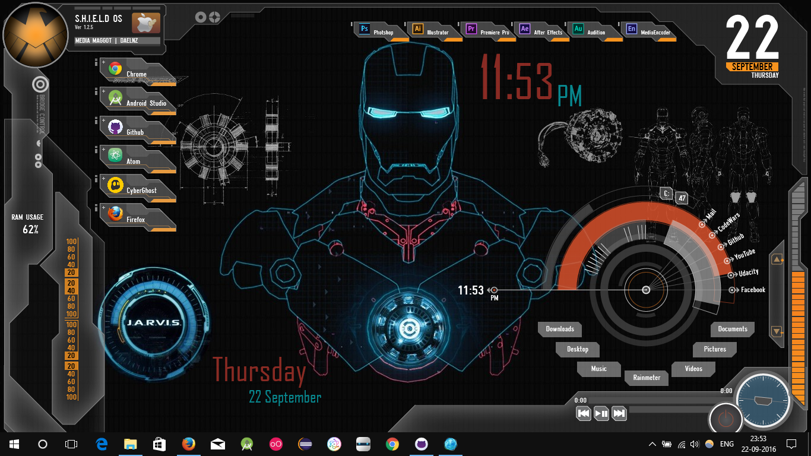

# Rainmeter Customization

The skins & layouts attached in this repository have been used to customized my desktop appearance. Rainmeter is an application which helps you to customize your desktop with the skins made by the users and by their community.

##Adoption

My skins are adopted from the post of the deviantart by the user edreyes which can be found [here easily](http://edreyes.deviantart.com/art/JARVIS-SHIELD-Interface-Rainmeter-Theme-310689538).

##How to Use

1. In order to use these skins & layouts, you should have Rainmeter installed or if not then get it installed from [here](https://www.rainmeter.net/).

2. You can also use their [Manuals and documentation](https://docs.rainmeter.net/) to build your own .rmskin file.
3. There are two ways in which you can customize your desktop using these repository files:
   
   A) Using the [.rmskin installers](/SkinInstallers).
   
   B) Copy the folders from [here](/Skins) to your /Rainmeter/Skins directory & reload your rainmeter, where these files will be automatically added.
   
4. The wallpaper used for the customization: 
    
    
    
5. I have adopted the layout from the [Avengers_Shield_OS](/SkinInstallers/avengers_s_h_i_e_l_d_os_ver_1_2_5_by_daelnz-d53bcju.rmskin).

 

## Layout

You can compare to my desktop screenshot as a reference:

